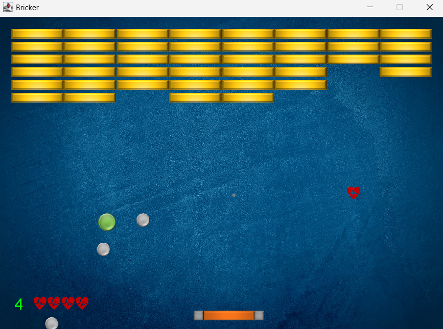
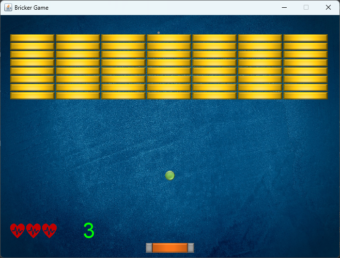

  <h1 align="center" style="border-bottom: none"><b>Exercise 3</b> - Bricker</h1>

  

    <b>Bricker</b> is the 3rd exercise I've solved in Huji's <b>Introduction to Object-Oriented Programming</b> course.
     
    The main idea behind this exercise is to get familiar with <b>Inheritance</b>, <b>Basic Game Development</b> and <b>DanoGameLab</b>.
     
     
    <a href="https://github.com/Noamshabat1/Introduction-to-Object-Oriented-Programming"><strong>« Home Page</strong></a>
     
  

 

  <h2 align="left" style="border-bottom: 1px solid gray">Usage</h2>

  
Run the project on your personal machine

  <ol align="left">
    <li>Clone this repository using <code>git clone &lt;url&gt;</code></li>
    <li>Open the cloned project in your IDE</li>
    <li>Use JDK 11 to compile all relavant files and run</li>
  </ol>

 

  <h2 align="left" style="border-bottom: 1px solid gray">Media</h2>

  

    
     
     
  

 

  <h2 align="left" style="border-bottom: 1px solid gray">Contributing</h2>

  

    Pull requests are welcome. For major changes, please open an issue first to discuss what you would like to change.
  

 

  <h2 align="left" style="border-bottom: 1px solid gray">License</h2>

  

    <a href="https://choosealicense.com/licenses/mit/">Licensed under MIT</a>
  

